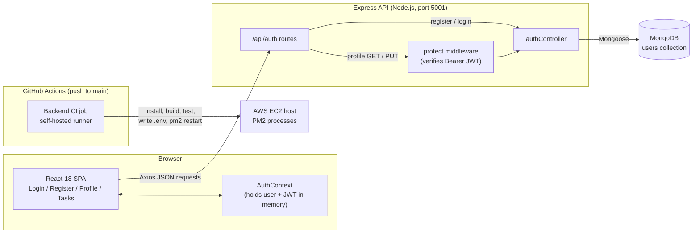

# Startup Incubation Management Platform

> A MERN-stack web app for university startup incubators: a working JWT-secured user and profile core, with applications, mentoring, milestones and demo day designed as the next modules.

---

## Overview

Startup Incubation Management Platform is a full-stack web application (MongoDB, Express, React, Node.js) designed to bring a university incubator's program onto one platform: applications, mentor matching, milestone tracking and demo day logistics.

The current codebase delivers the **foundation layer**: user registration, login, JWT-protected profile management, a MongoDB data layer, unit tests, and a GitHub Actions pipeline that builds, tests and restarts the app on an AWS EC2 host. The incubation-specific modules exist as a system design and roadmap (see [Features](#features)).

### Problem
* **The Challenge:** University incubators often run their programs across spreadsheets, email threads and shared drives: applications arrive in one place, mentor availability in another, and milestone progress lives in scattered documents.
* **The Impact:** Staff spend time consolidating information by hand, students have no single view of where their application or startup stands, and demo day preparation depends on manual coordination.

### Solution & Key Metrics
Startup Incubation Management Platform addresses this by providing a single authenticated web platform with one account per user and a shared backend API, which the incubation modules (applications, mentors, milestones, demo day) are designed to build on.

* **🔌 API surface:** 4 REST endpoints registered under `/api/auth`, 2 of them protected by JWT middleware.
* **🧪 Automated tests:** 10 backend unit tests (Mocha + Chai + Sinon) across 4 test suites, all passing.
* **⚙️ CI/CD pipeline:** 1 GitHub Actions job with 11 steps, running on a self-hosted runner and restarting the app with PM2.
* **🖥️ Frontend routes:** 4 React Router pages (Login, Register, Profile, Tasks).
* **🔐 Security:** passwords hashed with bcrypt (salt rounds: 10); JWTs signed with `JWT_SECRET` and valid for 30 days.

---

## How It Works

Here is a high-level overview of the system architecture and data flow:



1. A user registers or logs in from the React frontend; Axios sends the request to `POST /api/auth/register` or `POST /api/auth/login`.
2. The controller validates the credentials against MongoDB (via Mongoose, with bcrypt-hashed passwords) and returns a JWT.
3. The frontend stores the user and token in `AuthContext` and sends it as `Authorization: Bearer <token>` on protected calls.
4. The `protect` middleware verifies the token and loads the user before `GET`/`PUT /api/auth/profile` runs.
5. On every push to `main`, the GitHub Actions job on the self-hosted runner installs dependencies, builds the frontend, runs the backend tests, writes the production `.env`, and restarts the app with PM2.

---

## Features

### Implemented (in code today)
- User registration with duplicate-email check and bcrypt password hashing
- Login returning a signed JWT (30-day expiry)
- JWT `protect` middleware for protected routes
- View and update profile (name, email, university, address) via a React form
- Backend task CRUD controller (`getTasks`, `addTask`, `updateTask`, `deleteTask`) with 10 unit tests
- Tailwind-styled React UI with a Navbar that adapts to logged-in state
- CI pipeline on a self-hosted runner with PM2 restart

### Known gaps
- `backend/routes/taskRoutes.js` does not exist and the `/api/tasks` mount in `server.js` is commented out, so the **Tasks page cannot reach a backend endpoint yet**. The task controller is unit-tested but not exposed over HTTP.
- `frontend/src/components/Application.jsx` is an empty placeholder.
- The `User` model has no role field, so there is one generic user type; student / mentor / admin roles are not enforced.
- The default frontend test (`App.test.js`) is the Create React App template and is not run in CI.

### Designed / Roadmap (not yet implemented)
| Area | Planned capability |
|---|---|
| Applications | Application form with save-draft and pitch deck / video / document upload; stage tracking timeline |
| Startup profiles | Logo, description, team members, links |
| Roles | Separate Student, Mentor and Administrator permissions |
| Mentoring | Mentor availability, office hour sessions, feedback |
| Milestones | Milestone and KPI tracking with admin monitoring |
| Demo day | Pitch slot booking and event scheduling |
| Platform | Calendar integration and a notification system |

---

## System Design

The platform was specified with SysML before implementation:

- **Requirement Diagram:** functional needs for students, mentors and administrators.
- **Block Definition Diagram (BDD):** system architecture and component blocks.
- **Parametric Diagram:** performance constraints.

Design guidelines for the next modules: implement backend functions for application data following the same API pattern as the existing auth and task controllers, with full CRUD for each functionality.

Project management followed Agile practice in **Jira** (epics, user stories and subtasks; sprint planning, execution and retrospective boards; GitHub integration for commit tracking).

---

## Tech Stack

| Layer | Technology |
|---|---|
| Frontend | React 18, React Router 6, Axios, Tailwind CSS 3 (Create React App) |
| Backend | Node.js, Express 4, Mongoose 6, jsonwebtoken, bcrypt, cors, dotenv |
| Database | MongoDB |
| Testing | Mocha, Chai, chai-http, Sinon |
| CI/CD | GitHub Actions (self-hosted runner), PM2 |
| Hosting | AWS EC2 |

---

## API Reference

Base URL: `http://localhost:5001` (local). Only the `/api/auth` router is registered in `backend/server.js`.

| Method | Endpoint | Auth | Description |
|---|---|---|---|
| POST | `/api/auth/register` | Public | Create a user (`name`, `email`, `password`); returns `id`, `name`, `email`, `token` |
| POST | `/api/auth/login` | Public | Authenticate (`email`, `password`); returns `id`, `name`, `email`, `token` |
| GET | `/api/auth/profile` | Bearer JWT | Return `name`, `email`, `university`, `address` |
| PUT | `/api/auth/profile` | Bearer JWT | Update any of `name`, `email`, `university`, `address`; returns the user and a fresh token |

---

## Getting Started

**Prerequisites:** Node.js (CI uses Node 22), npm, and a MongoDB connection string.

```bash
git clone https://github.com/matt94317/startup_incubation_management_platform.git
cd startup_incubation_management_platform

# Install root, backend and frontend dependencies
npm run install-all

# Configure the backend
cp backend/.env.example backend/.env
# then set MONGO_URI, JWT_SECRET and PORT in backend/.env

# Run backend (nodemon) and frontend together
npm run dev
```

The frontend runs at `http://localhost:3000` and calls the API at `http://localhost:5001` (set in `frontend/src/axiosConfig.jsx`).

**Environment variables** (`backend/.env`):

| Name | Purpose |
|---|---|
| `MONGO_URI` | MongoDB connection string |
| `JWT_SECRET` | Secret used to sign and verify JWTs (generate your own) |
| `PORT` | API port (defaults to 5001) |

**Run the backend tests:**

```bash
cd backend && npm test
```

---

## CI/CD

Workflow: `.github/workflows/ci.yml` ("Backend CI"), triggered on push to `main`. One job, `test`, runs on a **self-hosted runner** (the host running the app under PM2) with Node 22 and the `MONGO_URI` GitHub environment.

1. **Checkout Code** (`actions/checkout@v3`)
2. **Setup Node.js** 22 (`actions/setup-node@v3`)
3. **Print Env Secret:** echoes `MONGO_URI`, `JWT_SECRET`, `PORT` (GitHub masks secret values in logs)
4. `pm2 stop all`
5. **Install Backend Dependencies:** installs Yarn globally, then `yarn install` in `backend/`
6. **Install Frontend Dependencies:** removes the old `build/`, `yarn install`, `yarn run build` in `frontend/`
7. **Run Backend Tests:** `npm test` (Mocha) in `backend/` with secrets injected
8. `npm ci` at the repo root
9. Writes the `PROD` secret into `backend/.env`
10. `pm2 start all`
11. `pm2 restart all`

There is no separate SSH or artifact deploy step: deployment happens because the runner executes on the server itself and PM2 restarts the processes there.

---

## Project Structure

```
startup_incubation_management_platform/
├── .github/workflows/ci.yml      # GitHub Actions pipeline
├── package.json                  # Root scripts (install-all, dev, start)
├── backend/
│   ├── server.js                 # Express app; mounts /api/auth
│   ├── config/db.js              # Mongoose connection
│   ├── controllers/
│   │   ├── authController.js     # register, login, get/update profile
│   │   └── taskController.js     # task CRUD (not yet routed)
│   ├── middleware/authMiddleware.js  # JWT protect
│   ├── models/
│   │   ├── User.js               # name, email, password, university, address
│   │   └── Task.js               # userId, title, description, completed, deadline
│   ├── routes/authRoutes.js
│   ├── test/example_test.js      # 10 unit tests
│   └── .env.example
└── frontend/
    ├── src/
    │   ├── App.js                # Routes: /login /register /profile /tasks
    │   ├── axiosConfig.jsx       # API base URL
    │   ├── context/AuthContext.js
    │   ├── pages/                # Login, Register, Profile, Tasks
    │   └── components/           # Navbar, TaskForm, TaskList, Application (empty)
    └── tailwind.config.js
```
